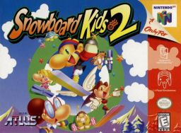

# Snowboard Kids 2



A (very much) work-in-progress matching decompilation of the greatest N64 game ever made, [Snowboard Kids 2](https://en.wikipedia.org/wiki/Snowboard_Kids_2).

This repository does **not** contain any game assets or assembly whatsoever. An existing copy of the game is required.

## Dependencies

This project has been tested on Ubuntu (x86). Your milege may vary on other systems.

System packages:

* make
* git
* docker
* python3
* pip3
* binutils-mips-linux-gnu

Build tools:

```bash
make setup
```

Build Python dependencies:

```bash
python3 -m venv .venv
source .venv/bin/activate
python3 -m pip install -U -r requirements.txt
```

## Building

Copy your big-endian Snowboard Kids 2 rom into the root of the repository. Rename it to `snowboardkids2.z64`. Then run:

```bash
make clean
make extract
make
```

If everything works correctly you should see:

```bash
build/snowboardkids2.z64: OK
```
