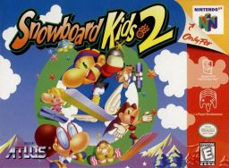

Snowboard Kids 2  
[](https://github.com/cdlewis/snowboardkids2-decomp/actions/workflows/build.yaml)
[](https://decomp.dev/cdlewis/snowboardkids2-decomp)
[](https://decomp.dev/cdlewis/snowboardkids2-decomp)
[](https://discord.gg/DuYH3Fh)
=============



A matching decompilation of the greatest N64 game ever made, [Snowboard Kids 2](https://en.wikipedia.org/wiki/Snowboard_Kids_2).

**This repository does not contain any game assets or assembly whatsoever. An existing copy of the game is required. This project is not a port, to PC or any other platform. It takes a Nintendo 64 rom, extracts assets from it, and combines them with C code we reverse-engineered from the rom, to produce an identical rom. It is explicitly a non-goal for this project to be used for any commercial purpose.**

## Cloning

Clone this repository, including its submodules:

```
git clone --recurse-submodules -j8 https://github.com/cdlewis/snowboardkids2-decomp.git
```

# Dependencies

This project has been tested on Debian/Ubuntu (x86) and macOS. Your mileage may vary on other systems.

System packages:

* make
* git
* python3
* pip3
* binutils-mips-linux-gnu

On Debian/Ubuntu:
```sh
sudo apt install make git python3 pip3 binutils-mips-linux-gnu
```

On macOS using homebrew. Note that calls below to `make` should use `gmake` instead to run the homebrew version.
```sh
brew install make tehzz/n64-dev/mips64-elf-binutils
```

Install toolchain:

```bash
make setup
```

Install Python dependencies in virtual environment:

```bash
python3 -m venv .venv
source .venv/bin/activate
python3 -m pip install -r requirements.txt
```

## Building

Copy your big-endian Snowboard Kids 2 rom into the root of the repository. Rename it to `snowboardkids2.z64`. Then run:

```bash
make clean
make extract
make
```

If everything works correctly you should see:

```bash
build/snowboardkids2.z64: OK
```

Articles
========

If you're interested in learning more about decompilation and Snowboard Kids 2, the following articles might be of interest:
* [Snowboard Kids 2 is Recompiled](https://blog.chrislewis.au/snowboard-kids-2-is-recompiled/)
* [Snowboard Kids 2 is 100% Decompiled](http://blog.chrislewis.au/snowboard-kids-2-is-100-decompiled/)
* [The Long Tail of LLM-Assisted Decompilation](https://blog.chrislewis.au/the-long-tail-of-llm-assisted-decompilation/)
* [Finding Jingle Town: Debugging an N64 Game without Symbols](https://blog.chrislewis.au/finding-jingle-town-debugging-an-n64-game-without-symbols/)
* [The Unexpected Effectiveness of One-Shot Decompilation with Claude](https://blog.chrislewis.au/the-unexpected-effectiveness-of-one-shot-decompilation-with-claude/)
* [Using Coding Agents to Decompile Nintendo 64 Games](https://blog.chrislewis.au/using-coding-agents-to-decompile-nintendo-64-games/)

Contributing
============
Contributions are most welcome! There are a variety of other ways you can assist:

* Fix compiler warnings
* Clean up code: you'll see plenty of hastily decompiled functions that use pointer arithmatic rather than propre struct access. We need help cleaning up these functions.
* Document code: some functions/variables have useful names (rather than func_XXX or D_XXX) but most don't. Some that do are incorrectly named. We need lots of help investigating and documenting what all these functions do.
* Support building the project on more platforms such as Windows or ARM Linux. Currently the build is only verified as working on Linux (x86) and macOS which limits who can contribute.

If you have any additional questions, please reach out on Discord (linked in the header). However please note that, since this is a clean room decompilation, we cannot accept contributions based on leaked source code or from those with proprietary knowledge about the game or related subjects.

Credits
=======

This project would not have been possible without all the amazing folks on the [N64 Decomp Discord Community](https://discord.gg/DuYH3Fh). In particular I would like to thank:

- [Bl00D4NGEL](https://github.com/Bl00D4NGEL)
- [inspectredc](https://github.com/inspectredc)
- [SlaveOfIDO](https://github.com/SlaveOfIDO)
- [queueRAM](https://github.com/queueRAM)

For all their help answering questions, solving problems and contributing matches.

The decomp community has some amazing platforms and tools. I am grateful to the maintainers of [decomp.me](https://decomp.me/), [decomp.dev](https://decomp.dev/), [Splat](https://github.com/ethteck/splat) and [decomp-permuter](https://github.com/simonlindholm/decomp-permuter) for building amazing tools.


I would 
