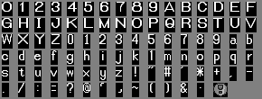

# Snowboard Kids 2 Font System

This document describes how the font system works in Snowboard Kids 2, including how text is encoded and how to decode it.

## Overview

The font system uses compressed sprite sheets containing character glyphs. Text is stored as 16-bit encoded values that combine a character index with its display width.

## Font Assets

The game uses two font assets for different purposes:

| Font | File | Usage |
|------|------|-------|
| `font_main` | `assets/font_main.bin` | Main text (menus, dialogs) |
| `font_race_timer` | `assets/font_race_timer.bin` | Race timer, HUD numbers |

### Main Font (font_main)

The main font texture is stored as a compressed asset:
- **File**: `assets/font_main.bin`
- **ROM address**: 0x3F3C50
- **Compressed size**: 2704 bytes
- **Decompressed size**: 8936 bytes (0x22E8)

### Decompression

The font uses an LZ77-like compression algorithm:

```
For each 2-byte pair:
  - If first byte == 0: output second byte as literal
  - Otherwise:
    - Lower nibble of byte1 + byte2 = 12-bit back-reference offset
    - Upper nibble of byte1 = count of bytes to copy
```

Use `tools/decompress_font.py` to decompress:
```bash
python3 tools/decompress_font.py
```

### Sprite Data Structure

The decompressed data follows this structure:

```c
typedef struct {
    /* 0x00 */ s32 textureBase;      // Base offset to texture data
    /* 0x04 */ s32 numFrames;        // Number of character glyphs (94)
    /* 0x08 */ SpriteFrameEntry frames[];  // Array of frame entries
} SpriteSheetData;

typedef struct {
    /* 0x00 */ s32 textureOffset;    // Offset from textureBase to glyph
    /* 0x04 */ u16 paletteIndex;     // Palette selection
    /* 0x06 */ u16 width;            // Glyph width in pixels
    /* 0x08 */ u16 height;           // Glyph height in pixels (always 16)
    /* 0x0A */ u16 paletteTableIndex;
    /* 0x0C */ u16 formatIndex;      // 0 = CI4 (4-bit color index)
    /* 0x0E */ u16 pad;
} SpriteFrameEntry;  // 16 bytes each
```

### Main Font Glyph Format

- **Dimensions**: 12×16 pixels per character
- **Color format**: CI4 (4-bit color index, 16 colors)
- **Total glyphs**: 94 characters

## Race Timer Font (font_race_timer)

The race timer font is a smaller font used for HUD elements:

- **File**: `assets/font_race_timer.bin`
- **ROM address**: 0x3F6950
- **Compressed size**: 608 bytes
- **Decompressed size**: 1288 bytes (0x508)
- **Glyph dimensions**: 8×16 pixels per character
- **Color format**: CI4 (4-bit color index)
- **Total glyphs**: 14 characters

### Character Mapping (Indices 0-13)

| Index | Char | Description |
|-------|------|-------------|
| 0-9 | 0-9 | Digits |
| 10 | G | Gold indicator |
| 11 | " | Seconds marker |
| 12 | ' | Minutes marker |
| 13 | : | Colon separator |

### Usage

The race timer font is used for:
- Race timers (minutes:seconds display)
- Score displays
- Lap counters
- Gold/silver indicators

Loaded via `loadTextRenderAsset(0)` or directly with `loadCompressedData(&font_race_timer_ROM_START, ...)`

## Text Encoding

### 16-bit Encoding Format

Each character is encoded as a 16-bit big-endian value:

```
┌───────────────┬─────────────────────┐
│ Bits 15-12    │ Bits 11-0           │
│ Width         │ Character Index     │
│ (in pixels)   │ (0-93)              │
└───────────────┴─────────────────────┘
```

- **Bits 12-15**: Character width in pixels (0 = use default width of 12)
- **Bits 0-11**: Character index into the font table

### Control Codes

Special 16-bit values are used for text control:

| Code | Name | Description |
|------|------|-------------|
| `0xFFFB` | Spacing | Adds horizontal spacing |
| `0xFFFC` | Skip | Skip marker (no output) |
| `0xFFFD` | Newline | Move to next line |
| `0xFFFE` | Space | Add spacing (4 pixels) |
| `0xFFFF` | End | End of text marker |

### Encoding Examples

| Text | Encoded Value | Explanation |
|------|---------------|-------------|
| 'A' (big) | `0x000A` | Index 10, default width |
| 'A' with width 8 | `0x800A` | Index 10, width 8 |
| 'a' (small) | `0x002E` | Index 46, default width |
| '!' | `0x0048` | Index 72, default width |
| Newline | `0xFFFD` | Control code |
| End | `0xFFFF` | End marker |

## Character Mapping

### Big Glyphs (Indices 0-35)

Large uppercase letters and digits (12×16 pixels):

```
Index 0-9:   0 1 2 3 4 5 6 7 8 9
Index 10-35: A B C D E F G H I J K L M N O P Q R S T U V W X Y Z
```

### Small Glyphs (Indices 36-93)

Small lowercase letters, digits, and symbols (12×16 pixels):

| Index Range | Characters |
|-------------|------------|
| 36-45 | Small digits: 0-9 |
| 46-71 | Lowercase: a-z |
| 72-93 | Symbols (see table below) |

### Symbol Table (Indices 72-93)

| Index | Char | Description |
|-------|------|-------------|
| 72 | `!` | Exclamation mark |
| 73 | `"` | Double quote |
| 74 | `#` | Hash/Pound |
| 75 | `` ` `` | Backtick |
| 76 | `*` | Asterisk |
| 77 | `+` | Plus |
| 78 | `,` | Comma |
| 79 | `-` | Hyphen/Minus |
| 80 | `.` | Period |
| 81 | `/` | Forward slash |
| 82 | `;` | Semicolon |
| 83 | `?` | Question mark |
| 84 | `"` | Open curly quote |
| 85 | `@` | At-sign (or close quote) |
| 86 | `╭` | Box corner (top-left) |
| 87 | `╯` | Box corner (bottom-right) |
| 88 | `~` | Tilde |
| 89 | `(` | Left parenthesis |
| 90 | `)` | Right parenthesis |
| 91 | `&` | Ampersand |
| 92 | `·` | Middle dot (superscript) |
| 93 | `◎` | Circle with exclamation |

## Font Texture Visualization

The decompressed font texture arranged as a grid:



**Grid layout**:

```
┌─────────────────────────────────────────────────────────────────┐
│  Big Glyphs (0-35)                                              │
│  ┌───┬───┬───┬───┬───┬───┬───┬───┬───┬───┬───┬───┬───┬───┬───┐ │
│  │ 0 │ 1 │ 2 │ 3 │ 4 │ 5 │ 6 │ 7 │ 8 │ 9 │ A │ B │ C │ D │ E │ │
│  ├───┼───┼───┼───┼───┼───┼───┼───┼───┼───┼───┼───┼───┼───┼───┤ │
│  │ F │ G │ H │ I │ J │ K │ L │ M │ N │ O │ P │ Q │ R │ S │ T │ │
│  ├───┼───┼───┼───┼───┼───┼───┼───┼───┼───┼───┼───┼───┼───┼───┤ │
│  │ U │ V │ W │ X │ Y │ Z │   │   │   │   │   │   │   │   │   │ │
│  └───┴───┴───┴───┴───┴───┴───┴───┴───┴───┴───┴───┴───┴───┴───┘ │
│                                                                 │
│  Small Glyphs (36-93)                                           │
│  ┌───┬───┬───┬───┬───┬───┬───┬───┬───┬───┬───┬───┬───┬───┬───┐ │
│  │ 0 │ 1 │ 2 │ 3 │ 4 │ 5 │ 6 │ 7 │ 8 │ 9 │ a │ b │ c │ d │ e │ │
│  ├───┼───┼───┼───┼───┼───┼───┼───┼───┼───┼───┼───┼───┼───┼───┤ │
│  │ f │ g │ h │ i │ j │ k │ l │ m │ n │ o │ p │ q │ r │ s │ t │ │
│  ├───┼───┼───┼───┼───┼───┼───┼───┼───┼───┼───┼───┼───┼───┼───┤ │
│  │ u │ v │ w │ x │ y │ z │ ! │ " │ # │ ` │ * │ + │ , │ - │ . │ │
│  ├───┼───┼───┼───┼───┼───┼───┼───┼───┼───┼───┼───┼───┼───┼───┤ │
│  │ / │ ; │ ? │ " │ @ │╭╭│╯╯│ ~ │ ( │ ) │ & │ · │ ◎ │   │   │ │
│  └───┴───┴───┴───┴───┴───┴───┴───┴───┴───┴───┴───┴───┴───┴───┘ │
└─────────────────────────────────────────────────────────────────┘
```

## Usage Examples

### Decoding Text

```python
from tools.font_char_map import decode_text

# Raw encoded bytes from ROM
encoded_data = bytes([0x00, 0x0A, 0x00, 0x2E, 0xFF, 0xFF])

# Decode to string
text = decode_text(encoded_data)
# Result: "Aa"
```

### Encoding Text

```python
from tools.font_char_map import encode_text

# Encode string to game format
encoded = encode_text("Hello", use_big=True)
# Result: bytes for H-e-l-l-o with default widths
```

### Reading Width from Encoded Text

```python
code = 0x800A  # 'A' with width 8
width = (code >> 12) & 0xF  # Extract bits 12-15
char_index = code & 0xFFF   # Extract bits 0-11

if width == 0:
    width = 12  # Default width

print(f"Character index: {char_index}, Width: {width}")
# Output: Character index: 10, Width: 8
```

## Code Reference

### Related Source Files

**Main font (font_main):**
- `src/36B80.c` - `loadTextRenderAsset()` loads the font asset
- `src/10AD0.c` - `renderTextSprite()` renders text to screen
- `src/B040.c` - Text width calculation functions

**Race timer font (font_race_timer):**
- `src/36B80.c` - `loadTextRenderAsset(0)` loads timer digits
- `src/4CD70.c` - Race HUD rendering (timers, scores, lap counters)
- `src/2F990.c` - Additional HUD elements
- `src/31870.c` - Score/time display functions
- `src/46080.c` - Race state UI

### Key Functions

```c
// Load font asset
// variant 0 = race timer font (font_race_timer)
// variant 1 = main font (font_main)
void *loadTextRenderAsset(s32 variant);

// Calculate text width
s16 getMaxLinePixelWidth(u16 *encodedText);

// Render text sprite
void renderTextSprite(TextRenderArg *arg0);
```

## Tools

- `tools/decompress_font.py` - Decompress font and export PNG images
- `tools/font_char_map.py` - Character mapping and encode/decode functions

### Export Font Images

```bash
python3 tools/decompress_font.py
```

This creates:
- `build/font_texture.png` - Combined grid of all characters
- `build/frame_XXX.png` - Individual character images
- `build/font_texture_raw.bin` - Raw decompressed data
